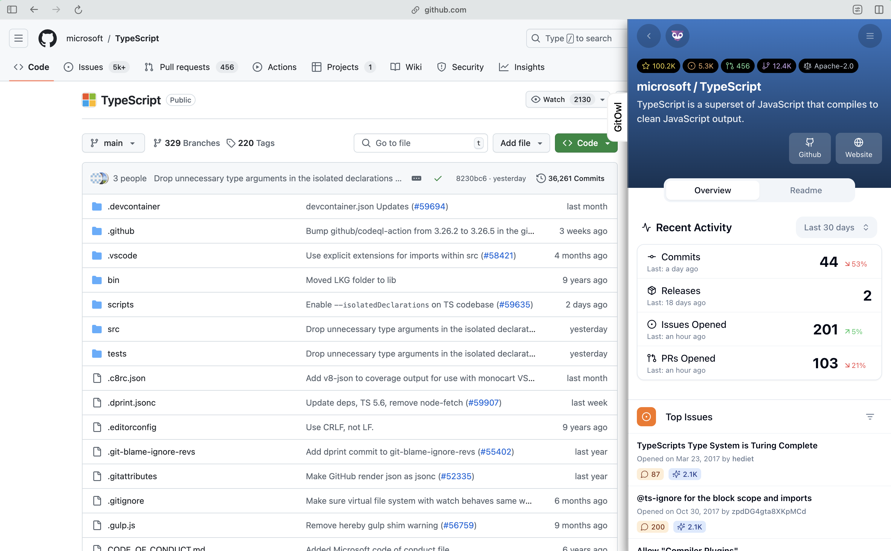

<h1 align="center">
  GitOwl Browser Extension
</h1>

<h3 align="center">
  <b><a href="https://gitowl.dev">gitowl.dev</a></b>
  <span> • </span>
  <b><a href="https://chrome.google.com/webstore/detail/gitowl/gijnkijpbdlefjnobncjfongkbpoohdb">chrome</a></b>
</h3>



This repository contains the source code for the GitOwl browser extension.

The extension aims to interact as little as possible with the websites on which it is run.

The extension functionality is limited to:
- Creating a drawer component for the GitOwl iframe
- Controlling the drawer state (width & open/closed)
- Identifying the entity (user/repository) being viewed
- Instantiating the GitOwl iframe

The extension currently works on:
- GitHub
- NPM
- PyPI

## Details

### Framing

- GitOwl iframe (`I2`) is created inside another iframe (`I1`) to avoid cross-origin issues.
- Content script identifies the entity being viewed and passes it as the `path` query parameter to `I1`.
- Content script updates the `src` attribute of `I1` on URL changes.
- Content script sends messages to `I1` on drawer opening.


### Content Script & Drawer

- Content script creates the following components:
  - Drawer
  - Drawer toggle button
  - IFrame (`I1`)
  - Drawer draggable handle
- Open/Closed state and width of the drawer are stored in local storage.
- Content script listens to changes in URL and updates the `src` attribute of `I1` accordingly.


## Development

1. Install dependencies
```shell
$ pnpm install
```

2. Run the dev script
```shell
$ pnpm dev
```

The extension preview will be available at `http://localhost:5173`. Alternatively, it can also be loaded as an unpacked extension (see below).

### Loading the extension (Chrome)

```shell
# Builds the extension and watches for changes
$ pnpm build:watch
```

- Open the Extension Management page by navigating to `chrome://extensions`.
- Enable Developer Mode by clicking the toggle switch next to Developer mode.
- Click the `LOAD UNPACKED` button and select the `dist` directory.
- Note: there is no automatic reloading, so you will need to manually reload the extension to see changes.


## Build & Pack

The build script simply bundles the extension and zips the contents of the `dist` directory.

```shell
$ ./scripts/build.sh
```
