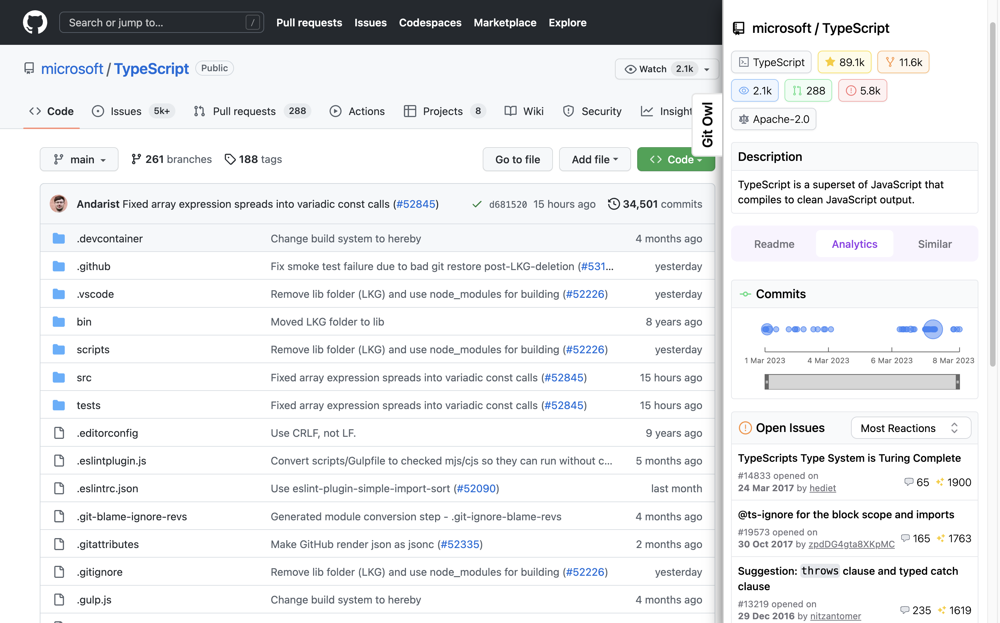

## GitOwl Browser Extension

<h3 align="center">
  <b><a href="https://gitowl.dev">gitowl.dev</a></b>
  <span> • </span>
  <b><a href="https://google.com">chrome</a></b>
</h3>



This repository contains the source code for GitOwl browser extension.

The extension aims to interact as little as possible with the websites on which it is run.

The extension functionality is limited to:
- Creating a drawer component to display GitOwl iframe in.
- Identifying the entity (user/repository) being viewed.
- Constructing URL for GitOwl iframe.
- Creating a GitOwl iframe.
- Controlling open/closed state of the drawer.

The extension currently works on:
- GitHub
- NPM
- PyPI

## Details

### Framing

- GitOwl iframe (`I2`) is created inside another iframe (`I1`) to avoid cross-origin issues.
- Content script identifies the entity being viewed and passes it as the `path` query parameter to `I1`.
- Content script updates the `src` attribute of `I1` on URL changes.
- Content script sends messages to `I1` on drawer opening.


### Content Script & Drawer

- Content script creates the following components:
  - Drawer
  - Drawer toggle button
  - IFrame (`I1`)
  - Drawer draggable handle
- Open/Closed state and width of the drawer are stored in local storage.
- Content script listens to changes in URL and updates the `src` attribute of `I1` accordingly.


## Development

To run the extension locally

### Build the extension

```shell
$ npm install
$ npm run build
```

### Load the extension

- Open the Extension Management page by navigating to `chrome://extensions`.
- Enable Developer Mode by clicking the toggle switch next to Developer mode.
- Click the LOAD UNPACKED button and select the `dist` directory.